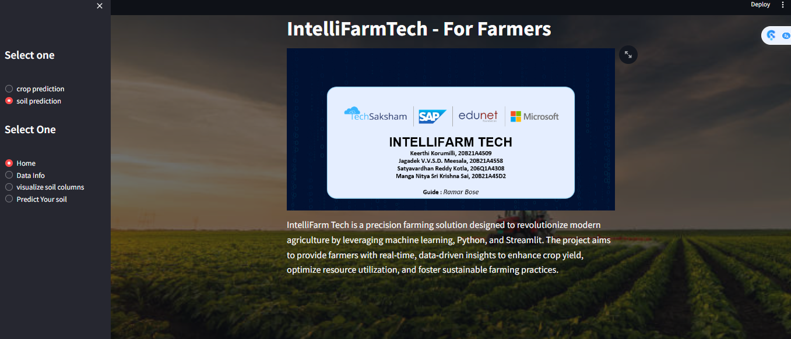
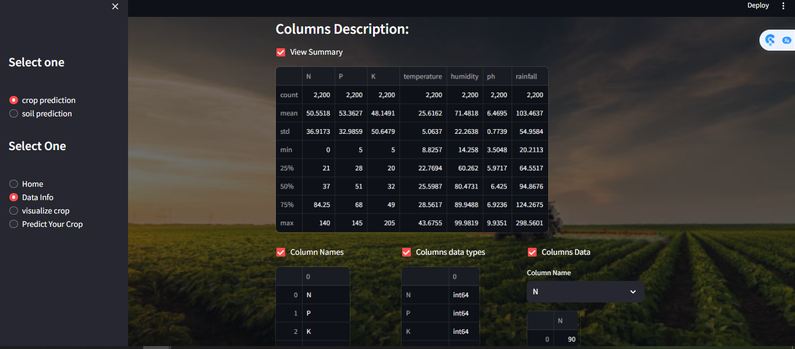
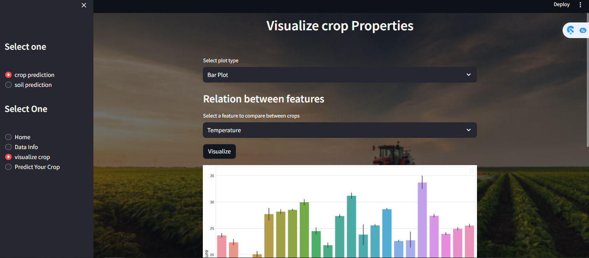
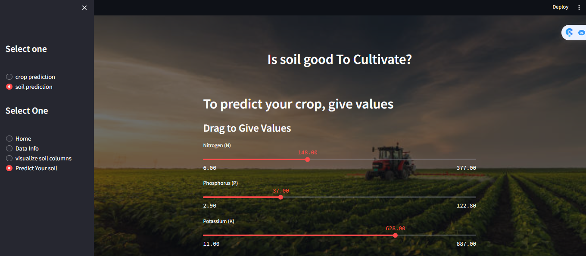
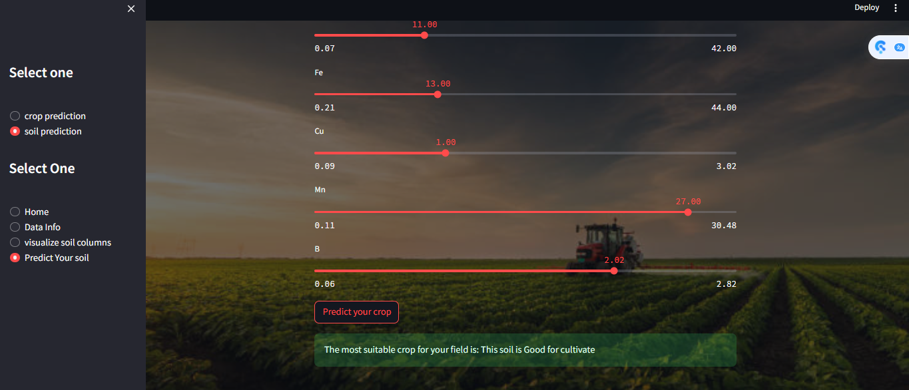

# IntelliFarm Tech

## Abstract

IntelliFarm Tech is a precision farming solution designed to revolutionize modern agriculture by leveraging machine learning, Python, and Streamlit. The project aims to provide farmers with real-time, data-driven insights to enhance crop yield, optimize resource utilization, and foster sustainable farming practices.

## Home Page of the project

## Data Info Page of the Project

## Table of Contents

- [Abstract](#abstract)
- [Problem Statement](#problem-statement)
- [Aim and Objectives](#aim-and-objectives)
- [System Design/Architecture](#system-designarchitecture)
- [System Development Approach (Technology Used)](#system-development-approach-technology-used)
- [Algorithm](#algorithm)
- [Analysis and Planning](#analysis-and-planning)
- [Data Preparation](#data-preparation)
- [Machine Learning Models](#machine-learning-models)
- [User Interface](#user-interface)
- [Testing and Deployment](#testing-and-deployment)

## Problem Statement

Agricultural communities face challenges such as suboptimal crop yields, diminished returns on investment, and a lack of informed decisions for veteran farmers regarding suitable crops.

## Visualize The Crop

## Aim and Objectives

- **Aim:** To empower farmers through data-driven insights and technology.
  
- **Objectives:**
  1. Provide data-driven insights.
  2. Suggest crops, fertilizers, and assess soil quality.
  3. Develop a user-friendly UI for farmers.
  4. Make the platform free of cost for broader accessibility.

## System Design/Architecture

IntelliFarm Tech integrates Python and machine learning at the backend, with Streamlit serving as the GUI.

## Predicting The Crop

## System Development Approach (Technology Used)

- **Algorithm:**
  - Logistic Regression
  - Random Forest Classifier
  - Scikit Learn
  - Matplotlib
  - NumPy and Pandas

## Analysis and Planning

Identify farmer needs, define scope, allocate resources, and set timelines.

## Data Preparation

Gather agricultural data (weather, soil, crops), clean, preprocess, and organize the data.

## Machine Learning Models

Develop crop, fertilizer, and soil analysis algorithms, train models using historical and real-time data.

## User Interface

Create a farmer-friendly Streamlit dashboard, design an intuitive navigation system.

## Testing and Deployment

Validate model accuracy through testing data, deploy the system on Azure.

## Outcome Of The Predicted Soil/Crop In The Project

Thank you
